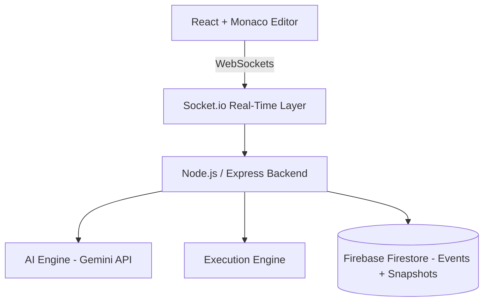

<div align="center">

# CodeSync

### Real-Time Collaborative IDE with AI Assistance & Distributed Session Architecture

A collaborative coding platform that lets multiple users write and execute code together in shared sessions, with AI-powered code intelligence and full session replay.

**[Live Demo](https://code-sync-sooty.vercel.app/)**

</div>

---

## Table of Contents

- [Overview](#overview)
- [Key Features](#key-features)
- [System Architecture](#system-architecture)
- [Engineering Highlights](#engineering-highlights)
- [Tech Stack](#tech-stack)
- [Project Structure](#project-structure)
- [Getting Started](#getting-started)
- [Author](#author)

---

## Overview

CodeSync is a distributed, real-time collaborative development environment built for pair programming, technical interviews, and live coding sessions. Participants work in isolated rooms with synchronized editors, execute programs in multiple languages, and receive AI-assisted analysis of the code being written.

Every session is recorded as a stream of events, which makes it possible to reconstruct and replay the full history of a session after it ends.

---

## Key Features

### Real-Time Collaboration

- Multi-user live code synchronization across connected clients
- Room-based, isolated sessions
- Low-latency updates delivered over WebSockets

### Interview Mode

- Role-based coding sessions
- Controlled editing environments
- Structured evaluation flow

### AI Code Intelligence

- Code correctness analysis
- Optimization suggestions
- Complexity evaluation
- Interview question generation

### Session Replay

- Event-based tracking of session activity
- Full session reconstruction from recorded events
- Timeline-based debugging view

### Multi-Language Execution

- JavaScript runtime execution
- Python backend execution
- Live output streaming to all participants

---

## System Architecture



The client communicates with the backend through a Socket.io real-time layer. The backend coordinates the AI engine, the code execution engine, and persistence, with session events and snapshots stored in Firebase Firestore.

---

## Engineering Highlights

- **Event-driven distributed architecture:** session activity flows through events rather than shared mutable state.
- **Real-time synchronization system:** consistent editor state across concurrent collaborators.
- **AI-assisted development pipeline:** code analysis and question generation integrated into the session workflow.
- **Hybrid persistence:** live state over sockets, durable history in Firestore.
- **Session-based state reconstruction:** events and snapshots allow any session to be rebuilt and replayed.

---

## Tech Stack

| Layer | Technology |
| :--- | :--- |
| Frontend | React, Monaco Editor |
| Real-Time | Socket.io |
| Backend | Node.js, Express |
| AI | Google Gemini API |
| Database | Firebase Firestore |
| Hosting | Vercel |

---

## Project Structure

```text
CodeSync/
├── frontend/        # React client and Monaco Editor integration
├── server/          # Express and Socket.io backend
├── package.json
└── README.md
```

---

## Getting Started

### Prerequisites

- Node.js 18+
- npm 9+
- A Firebase project with Firestore enabled
- A Google Gemini API key

### Backend

```bash
cd server
npm install
npm start
```

### Frontend

```bash
cd frontend
npm install
npm run dev
```

Configure the Firebase credentials and Gemini API key through environment variables before starting the services.

---

## Author

**Chella Krishnan D**
[GitHub](https://github.com/iamkr07) · [LinkedIn](https://linkedin.com/in/chella-krishnan-d-a91172383)
